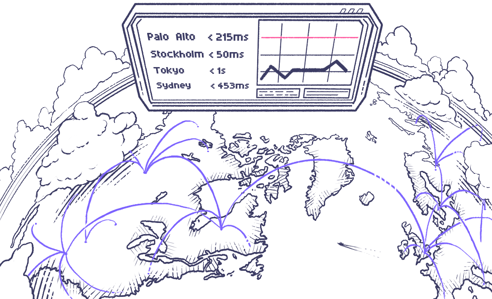

 

# k6 Operator

`grafana/k6-operator` is a Kubernetes operator for running distributed k6 tests in your cluster.

Read also the [complete tutorial](https://k6.io/blog/running-distributed-tests-on-k8s/) to learn more about how to use this project.

## Setup

### Deploying the operator
Install the operator by running the command below:

```bash
$ make deploy
```

### Installing the CRD

The k6 operator includes one custom resource called `K6`. This will be automatically installed when you do a
deployment, but in case you want to do it yourself, you may run the command below:

```bash
$ make install
```

## Usage

Two samples are available in `config/samples`, one for a test script and one for an actual test run.

### Adding test scripts

The operator utilises `ConfigMap`s and `LocalFile` to serve test scripts to the jobs. To upload your own test script, run the following command to configure through `ConfigMap`:

#### ConfigMap
```bash
$ kubectl create configmap my-test --from-file /path/to/my/test.js
```

***Note: there is a character limit of 1048576 bytes to a single configmap. If you need to have a larger test file, you'll need to use a volumeClaim or a LocalFile instead***

#### VolumeClaim

There is a sample avaiable in `config/samples/k6_v1alpha1_k6_with_volumeClaim.yaml` on how to configure to run a test script with a volumeClaim.

If you have a PVC with the name `stress-test-volumeClaim` containing your script and any other supporting file(s), you can pass it to the test like this:

```
spec:
  parallelism: 2
  script:
    volumeClaim:
      name: "stress-test-volumeClaim"
      file: "test.js"
```

***Note:*** the pods will expect to find script files in `/test/` folder. If `volumeClaim` fails, it's the first place to check: the latest initializer pod does not generate any logs and when it can't find the file, it will terminate with error. So missing file may not be that obvious and it makes sense to check it manually. See #143 for potential improvements.

##### Example directory structure while using volumeClaim

```
├── test
│   ├── requests
│   │   ├── stress-test.js
│   ├── test.js
```
In the above example, `test.js` imports a function from `stress-test.js` and they would look like this:
```js
// stress-test.js
import stress-test from "./requests/stress-test.js";

export let options = {
      vus: 50,
      duration: '10s'
    };

export default function () {
      stress-test();
}
```
```js
// stress-test.js
import { sleep, check } from 'k6';
import http from 'k6/http';


export default () => {
  const res = http.get('https://test-api.k6.io');
  check(res, {
    'status is 200': () => res.status === 200,
  });
  sleep(1);
};

```

#### LocalFile

There is a sample avaiable in `config/samples/k6_v1alpha1_k6_with_localfile.yaml` on how to configure to run a test script inside the docker image.

***Note: if there is any limitation on usage of volumeClaim in your cluster you can use this option, but always prefer the usage of volumeClaim.***

### Executing tests

Tests are executed by applying the custom resource `K6` to a cluster where the operator is running. The properties
of a test run are few, but allow you to control some key aspects of a distributed execution.

```yaml
# k6-resource.yml

apiVersion: k6.io/v1alpha1
kind: K6
metadata:
  name: k6-sample
spec:
  parallelism: 4
  script:
    configMap:
      name: k6-test
      file: test.js
  separate: false
  runner:
    image: <custom-image>
    metadata:
      labels:
        cool-label: foo
      annotations:
        cool-annotation: bar
    securityContext:
      runAsUser: 1000
      runAsGroup: 1000
      runAsNonRoot: true
    resources:
      limits:
        cpu: 200m
        memory: 1000Mi
      requests:
        cpu: 100m
        memory: 500Mi
  starter:
    image: <custom-image>
    metadata:
      labels:
        cool-label: foo
      annotations:
        cool-annotation: bar
    securityContext:
      runAsUser: 2000
      runAsGroup: 2000
      runAsNonRoot: true
```

The test configuration is applied using

```bash
$ kubectl apply -f /path/to/your/k6-resource.yml
```

#### Parallelism
How many instances of k6 you want to create. Each instance will be assigned an equal execution segment. For instance,
if your test script is configured to run 200 VUs and parallelism is set to 4, as in the example above, the operator will
create four k6 jobs, each running 50 VUs to achieve the desired VU count.

#### Script
The name of the config map that includes our test script. In the example in the [adding test scripts](#adding-test-scripts)
section, this is set to `my-test`.

#### Separate
Toggles whether the jobs created need to be distributed across different nodes. This is useful if you're running a
test with a really high VU count and want to make sure the resources of each node won't become a bottleneck.

#### Serviceaccount

If you want to use a custom Service Account you'll need to pass it into both the starter and runner object:

```yaml
apiVersion: k6.io/v1alpha1
kind: K6
metadata:
  name: <test-name>
spec:
  script:
    configMap:
      name: "<configmap>"
  runner:
    serviceAccountName: <service-account>
  starter:
    serviceAccountName: <service-account>
```

#### Runner

Defines options for the test runner pods. This includes:

* passing resource limits and requests
* passing in labels and annotations
* passing in affinity and anti-affinity
* passing in a custom image

#### Starter

Defines options for the starter pod. This includes:

* passing in custom image
* passing in labels and annotations

### k6 outputs

#### k6 Cloud output

k6 supports [output to its Cloud](https://k6.io/docs/results-visualization/cloud) with `k6 run --out cloud script.js` command. This feature is available in k6-operator as well for subscribed users. Note that it supports only `parallelism: 20` or less.

To use this option in k6-operator, set the argument in yaml:

```yaml
...
  script:
    configMap:
      name: "<configmap>"
  arguments: --out cloud
...
```

Then uncomment cloud output section in `config/default/kustomization.yaml` and copy your token from the Cloud there:

```yaml
# Uncomment this section if you need cloud output and copy-paste your token
secretGenerator:
- name: cloud-token
  literals:
  - token=<copy-paste-token-string-here>
  options:
    annotations:
      kubernetes.io/service-account.name: k6-operator-controller
    labels:
      k6cloud: token
```

This is sufficient to run k6 with the Cloud output and default values of `projectID` and `name` (`"k6-operator-test"`). For non-default values, extended script options can be used like this:

```js
export let options = {
  ...
  ext: {
    loadimpact: {
      name: 'Configured k6-operator test',
      projectID: 1234567,
    }
  }
};
```

### Cleaning up between test runs
After completing a test run, you need to clean up the test jobs created. This is done by running the following command:
```bash
$ kubectl delete -f /path/to/your/k6-resource.yml
```

### Multi-file tests

In case your k6 script is split between more than one JS file, you can simply create a configmap with several data entries like this:
```bash
kubectl create configmap scenarios-test --from-file test.js --from-file utils.js
```

If there are too many files to specify manually, kubectl with folder might be an option:
```bash
kubectl create configmap scenarios-test --from-file=./test
```

Alternatively, you can create an archive with k6:
```bash
k6 archive test.js [args]
```

The above command will create an archive.tar in your current folder unless `-O` option is used to change the name of the output archive. Then it is possible to put that archive into configmap similarly to JS script:
```bash
kubectl create configmap scenarios-test --from-file=archive.tar
```

In case of using an archive it must be additionally specified in your yaml for K6 deployment:

```bash
...
spec:
  parallelism: 1
  script:
    configMap:
      name: "crocodile-stress-test"
      file: "archive.tar" # <-- change here
```

In other words, `file` option must be the correct entrypoint for `k6 run`.

### Using extensions
By default, the operator will use `loadimpact/k6:latest` as the container image for the test jobs. If you want to use
extensions built with [xk6](https://github.com/grafana/xk6) you'll need to create your own image and override the `image`
property on the `K6` kubernetes resource. For example, the following Dockerfile can be used to create a container
image using `https://github.com/grafana/xk6-output-prometheus-remote` as an extension:


```Dockerfile
# Build the k6 binary with the extension
FROM golang:1.18.1 as builder

RUN go install go.k6.io/xk6/cmd/xk6@latest
RUN xk6 build --output /k6 --with github.com/grafana/xk6-output-prometheus-remote@latest

# Use the operator's base image and override the k6 binary
FROM loadimpact/k6:latest
COPY --from=builder /k6 /usr/bin/k6
```

If we build and tag this image as `k6-prometheus:local`, then we can use it as follows:

```yaml
# k6-resource-with-extensions.yml

apiVersion: k6.io/v1alpha1
kind: K6
metadata:
  name: k6-sample-with-extensions
spec:
  parallelism: 4
  script:
    configMap:
      name: crocodile-stress-test
      file: test.js
  arguments: -o output-prometheus-remote
  runner:
    image: k6-prometheus:local
    env:
      - name: K6_PROMETHEUS_REMOTE_URL
        value: http://prometheus.somewhere:9090/api/v1/write
```

Note that we are replacing the test job image (`k6-prometheus:latest`), passing required arguments to `k6`
(`-o output-prometheus-remote`), and also setting the environment variable to the runner (`K6_PROMETHEUS_REMOTE_URL`).

<!-- If using the Prometheus Operator, you'll also need to create a pod monitor:

```yaml
apiVersion: monitoring.coreos.com/v1
kind: PodMonitor
metadata:
  name: k6-monitor
spec:
  selector:
    matchLabels:
      app: k6
  podMetricsEndpoints:
  - port: metrics
``` -->

### Scheduling Tests

While the k6 operator doesn't support scheduling k6 tests directly, the recommended path for scheduling tests is to use the cronjobs object from k8s directly. The cron job should run on a schedule and run a delete and then apply of a k6 object

Running these tests requires a little more setup, the basic steps are:

1. Create a configmap of js test files (Covered above)
1. Create a configmap of the yaml for the k6 job
1. Create a service account that lets k6 objects be created and deleted
1. Create a cron job that deletes and applys the yaml

Add a configMapGenerator to the kustomization.yaml:

```yaml
configMapGenerator:
  - name: <test-name>-config
    files:
      - <test-name>.yaml
```

Then we are going to create a service account for the cron job to use:

This is required to allow the cron job to actually delete and create the k6 objects.

```yaml
---
apiVersion: rbac.authorization.k8s.io/v1
kind: Role
metadata:
  name: k6-<namespace>
rules:
  - apiGroups:
      - k6.io
    resources:
      - k6s
    verbs:
      - create
      - delete
      - get
      - list
      - patch
      - update
      - watch
---
kind: RoleBinding
apiVersion: rbac.authorization.k8s.io/v1
metadata:
  name: k6-<namespace>
roleRef:
  kind: Role
  name: k6-<namespace>
  apiGroup: rbac.authorization.k8s.io
subjects:
  - kind: ServiceAccount
    name: k6-<namespace>
    namespace: <namespace>
---
apiVersion: v1
kind: ServiceAccount
metadata:
  name: k6-<namespace>
```

We're going to create a cron job:

```yaml
# snapshotter.yml
apiVersion: batch/v1beta1
kind: CronJob
metadata:
  name: <test-name>-cron
spec:
  schedule: "<cron-schedule>"
  concurrencyPolicy: Forbid
  jobTemplate:
    spec:
      template:
        spec:
          serviceAccount: k6
          containers:
            - name: kubectl
              image: bitnami/kubectl
              volumeMounts:
                - name: k6-yaml
                  mountPath: /tmp/
              command:
                - /bin/bash
              args:
                - -c
                - "kubectl delete -f /tmp/<test-name>.yaml; kubectl apply -f /tmp/<test-name>.yaml"
          restartPolicy: OnFailure
          volumes:
            - name: k6-yaml
              configMap:
                name: <test-name>-config
```


## Uninstallation
Running the command below will delete all resources created by the operator.
```bash
$ make delete
```

## Developing Locally

### Run Tests

#### Pre-Requisites

- [operator-sdk](https://sdk.operatorframework.io/docs/installation/)

#### Test Setup

- `make test-setup` (only need to run once)

#### Run Unit Tests

- `make test`

#### Run e2e Tests

- [install kind and create a k8s cluster](https://kind.sigs.k8s.io/docs/user/quick-start/) (or create your own dev cluster)
- `make e2e`
- validate tests have been run
- `make e2e-cleanup`

## See also

- [Running distributed k6 tests on Kubernetes](https://k6.io/blog/running-distributed-tests-on-k8s/)
