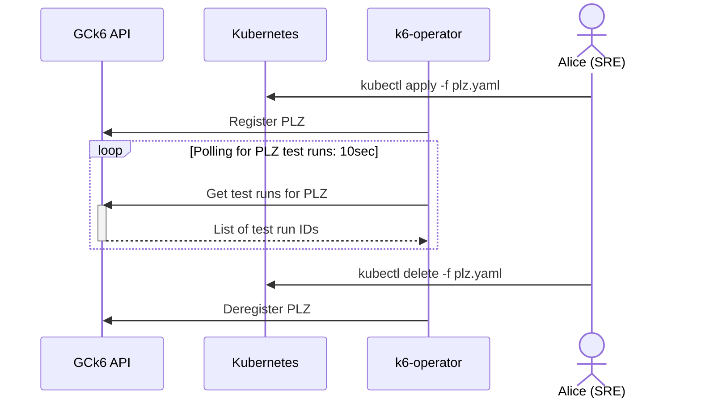
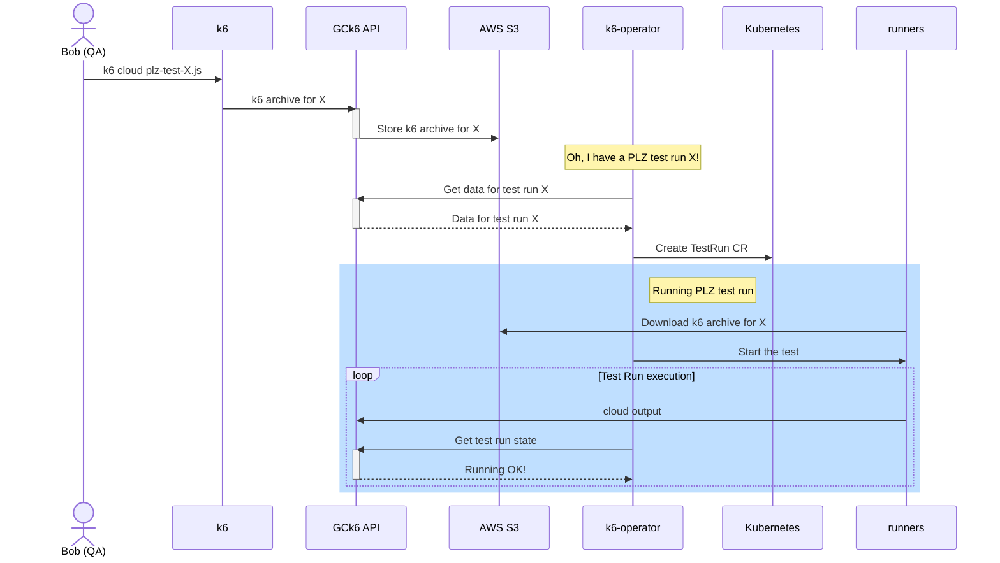

# Private Load Zone under the hood

Private Load Zone (PLZ) feature requires k6-operator to communicate regularly with Grafana Cloud k6 (GCk6) API. This document aims to describe the data flow of that communication.

## PLZ lifecycle

PLZ resource is explicitly created and explicitly destroyed by the user, e.g. with standard `kubectl` tooling. Once PLZ resource is created, k6-operator registers it with GCk6 and starts a polling loop. GCk6 is polled each 10 seconds for new test runs to be executed on the PLZ:

In other words, there are three HTTP REST calls to GCk6 in the above workflow: to register, to deregister and to poll test runs. More on GCk6 REST API can be found [here](https://grafana.com/docs/grafana-cloud/k6/reference/cloud-rest-api/#read-test-runs).

## Lifecycle of PLZ test run

When a user starts any GCk6 test run, k6 first creates an [archive](https://grafana.com/docs/k6/latest/misc/archive/#k6-cloud-execution) with it and sends it to GCk6. First GCk6 executes internal validation of the archive and, in case of PLZ test run, stores the archive to AWS S3 with the [presigned URL](https://docs.aws.amazon.com/AmazonS3/latest/userguide/using-presigned-url.html) and expiration time set to 300 seconds. GCk6 then notifies k6-operator about this test run during the next polling check, as described [above](#plz-lifecycle).

Once k6-operator learns of a new PLZ test run, it requests additional info about this test run from GCk6. Test run data returned by GCk6 contains presigned URL to S3 bucket and some additional information, like public Docker image containing k6 (`grafana/k6`) and amount of runners needed for this test run. Using this information, k6-operator then creates a `TestRun` custom resource (CR). 

As the PLZ `TestRun` has presigned URL configured as a path to k6 script, each runner Pod will download k6 archive from this URL in init container. The PLZ `TestRun` is also configured as a [cloud output test run](https://grafana.com/docs/k6/latest/results-output/real-time/cloud/) so runners are streaming metrics to GCk6 for aggregation, storage and visualization. 

Otherwise, PLZ `TestRun` is processed by k6-operator as any other `TestRun`, but with two additional HTTP REST calls to GCk6:
- a call that checks if test run is being processed without error by GCk6 and whether there is a user abort
- _optional_ a call that sends events about errors to GCk6 in case the test cannot be executed (e.g. something is off with infrastructure)
