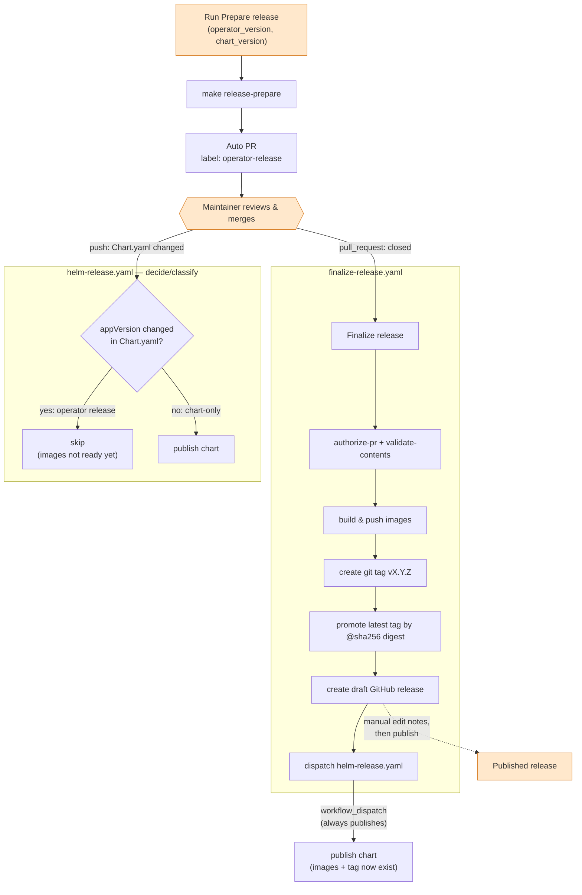

## Release process

The release is split into two GA workflows, to achieve maximum automation while keeping human review in place. The flow:

### Maintainer's actions

1. Start the "Prepare release" GH workflow manually.
    - `operator_version`: new version of the app, e.g. `v1.5.0`. Prerelease suffixes such as `v1.5.0-rc1` are supported, but build metadata is not (the version is also used in Docker image tags).
    - `chart_version`: the Helm chart version, e.g. `4.5.0`.
1. Once PR is ready, review it and merge.
1. Once images and tags are built and pushed, go edit draft release and publish it.

### Helm-only release

Helm releases can be done separately from the k6-operator releases, e.g. for chart bug fixes. To do that, bump version in `Chart.yaml`, run `make patch-helm-crd && make helm-docs && make helm-schema` as a PR and merge it. This will trigger the Helm release workflow.

### Custom image tags

Use the "Publish k6-operator images" workflow for special image tags. This workflow is manual-only and does not update release files, create a GitHub release, or publish Helm chart changes.

By default, special image builds push only the requested versioned tags. Set `promote_latest` only when the special build should also move `latest`, `latest-runner`, and `latest-starter`.

### Errors on release

The most likely causes for failure of the release preparation workflows: generator failures and CI bugs. Fix the issues and re-run it.

The finalization workflow is intentionally strict before creating tags and draft releases. If it fails and you need to recover it, re-run the failed run from the GitHub Actions UI : this replays the same merge event. The re-run is idempotent: it skips tag creation when the tag already points at the merge commit, and updates the
existing draft release in place. A re-run is refused only if the release has already been published, which can be done only by a human and is considered final.

#### Chart not published

The last step of finalization workflow is a fire-and-forget `workflow_dispatch` to the Helm release workflow. 

If finalization workflow is successful but the chart wasn't published successfully, you need to fix the issue and re-run only the Helm release workflow: either in UI, with `gh workflow run helm-release.yaml --ref main`, or `workflow_dispatch`.